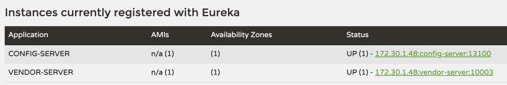
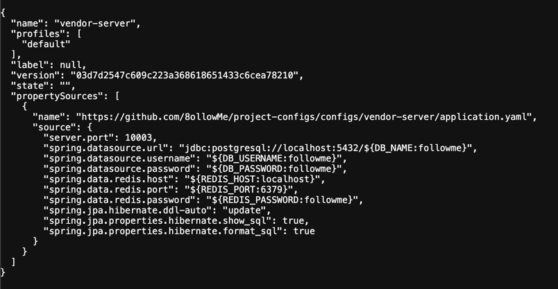

# 🗂️ Config Server 사용 가이드

본 프로젝트는 Spring Cloud Config를 사용하여 모든 마이크로서비스의 설정을 중앙 집중식으로 관리합니다.

모든 설정 값은 GitHub 저장소를 통해 관리되며, 런타임 중에 서버 재시작 없이 설정을 반영할 수 있습니다.

#### 실행 순서

1. Eureka 서버를 실행 시킵니다.
2. clone 받은 config-server를 실행 시킵니다.
3. 각 클라이언트 서비스를 실행(아래 설정 예시 참고)

---

## Config 저장소 정보

### 1. Config 저장소 정보

설정 파일이 저장되는 실제 GitHub 저장소 주소입니다.

- **Repository URL**: https://github.com/8ollowMe/project-configs
    - 설정 파일 업로드 타켓

- **Default Branch**: `dev`

- **Config Server 주소**: `http://localhost:13100`(개발 환경 기준)

### 2. 설정 파일 구조 및 규칙

**Config Server**는 아래 경로 순서대로 설정 파일을 탐색합니다.

1. `configs/common/`: 모든 서비스가 공통으로 사용하는 설정 (예: `application.yaml`)

2. `configs/{application}/{profile}/`: 특정 서비스의 환경별 설정 (예: `vendor-server/prod/`)

3. `configs/{application}/`: 특정 서비스의 공통 설정 (예: `vendor-server/application.yaml`)

#### 파일 명명 규칙

- `{application}.yaml`: 서비스 기본 설정

- `{application}-{profile}.yaml`: 환경별 오버라이드 설정 (예: `vendor-server-dev.yaml`)

---

## 클라이언트 서비스(개별 프로젝트) 설정

각 마이크로서비스에서 Config Server를 사용하기 위한 설정 방법입니다.

### 1) 의존성 추가 (build.gradle) [필수]

```groovy
dependencies {
    implementation 'org.springframework.cloud:spring-cloud-starter-config'
    implementation 'org.springframework.cloud:spring-cloud-starter-netflix-eureka-client' // 유레카 연동 시
}
```

### 2) 클라이언트 설정 (application.yaml) [필수]

#### eureka-server 사용 시

```yaml
spring:
  config:
    import: 'optional:configserver: '
  cloud:
    config:
      discovery:
        enabled: true
        service-id: config-server
```

#### 예시(Vendor)

```yaml
spring:
  application:
    name: vendor-server
  profiles:
    default: ${ACTIVE_PROFILE:default}
  config:
    # 유레카를 통해 접근 지연 및 실패 시, 직접 config-server 를 통해 설정을 받음
    import: "optional:configserver:http://localhost:13100"
  cloud:
    config:
      discovery:
        enabled: true
        service-id: config-server
eureka:
  instance:
    prefer-ip-address: false
    hostname: ${HOSTNAME:localhost}

  client:
    register-with-eureka: true
    fetch-registry: true
    service-url:
      defaultZone: ${EUREKA_SERVER_URL:http://localhost:13101/eureka/}
```

### 3) 환경 변수 기본값(default) 활용법 [선택]

> 환경 변수를 따로 지정하지 않으면 **기본 설정 값**을 따릅니다.

- **기본 설정 값** :
    - `eureka.instance.hostname`: `localhost`
    - `eureka.client.serviceUrl.defaultZone`: `http://localhost:13101/eureka/}`

#### 환경 변수 제어

- **설정 예시**: `hostname: ${HOSTNAME:localhost}`

- **동작 방식**:

    - 시스템 환경 변수에 `HOSTNAME이` 존재하면 해당 값을 사용합니다.

    - 값이 없으면 콜론(`:`) 뒤의 `localhost`를 기본값으로 사용합니다.

- **주요 적용 필드**:

    - `eureka.instance.hostname`: `${HOSTNAME:localhost}`

    - `eureka.client.serviceUrl.defaultZone`: `${EUREKA_SERVER_URL:http://localhost:13101/eureka/}`

#### ⚠️ 참고 사항

설정된 기본 환경 변수를 직접 제어할 수 있습니다.

- 아래는 설정 가능한 환경변수 예시 입니다.

```
HOSTNAME=localhost
EUREKA_SERVER_URL=http://127.0.0.1:13101/eureka/
```

---

## 설정 변경 및 실시간 반영 (Refresh)

GitHub 저장소(project-configs)의 파일 내용을 수정한 후, 서버 재시작 없이 반영하는 방법입니다.

1. **Git Push**: `project-configs` 저장소에 변경 사항을 Push합니다.

2. **Refresh 요청**: 해당 마이크로서비스에 `POST` 요청을 보냅니다.

    - **Endpoint**: `POST http://{service-host}:{port}/actuator/refresh`

    - **대상**: 설정 변경이 필요한 개별 마이크로서비스 (⚠️ Config Server 아님)

3. **주의사항**: 설정 값을 사용하는 빈(Bean)에 `@RefreshScope` 어노테이션이 붙어 있어야 실시간 반영이 가능합니다.

---

## 로컬 테스트 및 디버깅

내가 작성한 설정이 Config Server에서 어떻게 보이는지 브라우저에서 바로 확인할 수 있습니다.

- **URL 패턴**: `http://localhost:13100/{application}/{profile}`

- **예시**: `http://localhost:13100/vendor-server/dev` 호출 시 `vendor-server`의 `dev` 환경 설정값이 JSON 형태로 반환됩니다.
    - **profile 미사용 예시**: `http://localhost:13100/vendor-server/default` 호출 시 `configs/vendor-server/application.yaml`
      JSON 형태로 반환됩니다.

### 동작 성공 화면 예시

#### Eureka 서버에 config-server 등록 확인 예시

- **예시**:`http://localhost:13101/` - 예시 유레카 서버 url



#### config-server 정상 동작 예시

- **예시**: `http://localhost:13100/vendor-server/default`
  

---

## ⚠️ 주의 사항

> - **보안**: 데이터베이스 비밀번호나 API 키와 같은 민감 정보는 절대 평문으로 Push하지 마세요.
> - **우선순위**: 로컬에 있는 application.yaml 보다 Config Server에서 가져온 설정의 우선순위가 더 높습니다.(⚠️ 로컬 설정이 필요하면, config-server를 종료 후 사용)
